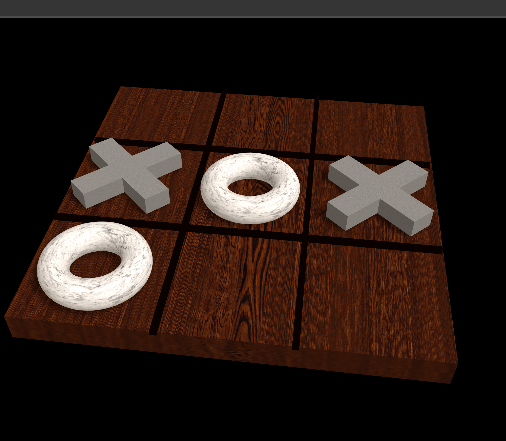

# 🟢 **Tres en Raya en 3D** 🎮

Un proyecto interactivo desarrollado con **Three.js** y **GSAP** que lleva el clásico juego de "Tres en Raya" a una experiencia visual en 3D.

---

## 🌟 **Características**
- Tablero tridimensional dinámico.
- Efectos visuales y animaciones fluidas con **GSAP**.
- Movimientos y controles fáciles de usar.
- Marcadores (X y O) animados.
- Sombreados y luces realistas para mejorar la inmersión.

---

## 🚀 **Instalación**
1. Clona este repositorio:
   ```bash
   git clone https://github.com/tu-usuario/tres-en-raya-3d.git
   cd tres-en-raya-3d

2. Ejecutar
   ```bash
   npm install
   node server.js

## Pictures

